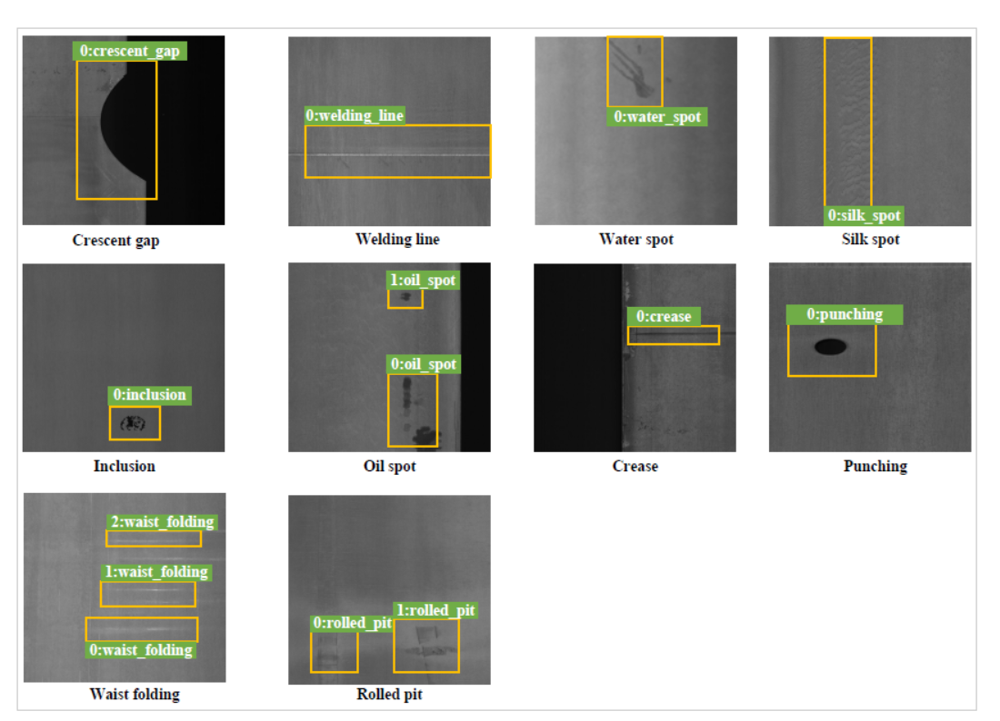

# GC10-DET-Metallic-Surface-Defect-Datasets
This is the GC10-DET datasets of the upcoming paper " Deep Metallic Surface Defect Detection: the New Benchmark and Detection Network" The images of 10 common Metallic Surface defects were collected, and their pixel level ground-truth were labeled.

 

 

Figure 1. An overview of our dataset.

  

It is welcomed to use our dataset. And if it is used in your research, please cite our paper.
If you have any questions, please contact me by 
Lvxiaoming1@gmail.com
